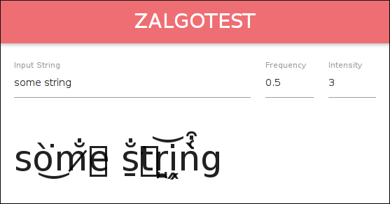

zalgify
=======

Written by [James Adam Buckland](https://github.com/ambuc). Licensed under the [MIT license](https://opensource.org/licenses/MIT).

Exports a function `zalgify` which applies the "zalgo" text obfuscation method. Play around with `frequency` and `intensity` for different levels and types of zalgo! You can use [the test page](https://cosmicexplorer.github.io/zalgify) to play around.
